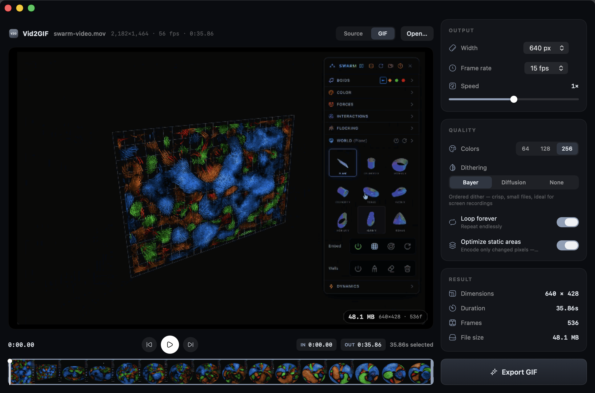

# Vid2GIF

A fast, native macOS video → GIF and WebM converter. GIF encoding is pure Swift on AVFoundation, VideoToolbox, and SwiftUI; WebM uses an installed FFmpeg encoder.




## Why it's fast

- **Hardware decode**: frames come off the VideoToolbox H.264/HEVC decoder, never a software path.
- **GPU scale + resample**: `AVAssetReaderVideoCompositionOutput` scales to the output size and resamples to the target frame rate in one GPU-composited pass.
- **Custom GIF89a encoder**: median-cut global palette, 15-bit nearest-color lookup table, hand-rolled LZW — no ImageIO, no ffmpeg.
- **Inter-frame delta encoding**: only changed pixels are stored (with a changed-region bounding box + transparency). Screen recordings shrink ~7×.

Measured on an Apple Silicon Mac: a 36-second 2182×1464 screen recording converts to a 640px 15fps GIF (536 frames) in **2.9 seconds** — ~12× realtime.

## The live preview

The preview pane shows the *actual encoded output* and regenerates automatically (debounced) whenever you touch a setting or trim handle, with the exact output file size in the corner. GIF previews use the real palette, dithering, and timing. WebM previews play the encoded video through WebKit, with controls for seeking and audio (muted initially).

## Features

- Drag & drop or ⌘O to open (MOV, MP4, M4V, and anything else AVFoundation reads)
- Filmstrip timeline with draggable trim handles and playhead scrubbing
- Keyboard: **Space** play/pause · **I**/**O** set in/out points · **←**/**→** frame step · **⌘E** export
- Output width presets, 10–30 fps, 0.25–4× playback speed
- **GIF / WebM format selector** — both respect trim, output width, frame rate, and speed
- GIF: 64/128/256 colors; Bayer (ordered), Floyd–Steinberg (diffusion), or no dithering
- GIF: loop-forever and "optimize static areas" (delta encoding) toggles
- WebM: VP9 video with Compact, Balanced, and High quality presets; optional Opus audio with pitch-preserving speed adjustment
- Result card with format-specific preview, drag-and-drop, Reveal in Finder, and Copy
- Cancel an export safely; existing destination files are replaced only after encoding succeeds

WebM preserves full color; GIF palette, dithering, delta, and loop settings apply only to GIF. Looping a WebM is controlled by its player or embedding website. The in-app WebM preview loops for convenience.

## Build & run

```bash
make run        # builds build/Vid2GIF.app and opens it
```

For WebM export, install FFmpeg with VP9 (`libvpx-vp9`) and Opus (`libopus`) support:

```bash
brew install ffmpeg
```

The app finds FFmpeg in its resources, standard Homebrew locations, or `PATH`, including when launched from Finder. FFmpeg is not bundled by `make app`. GIF export needs no external dependencies; if FFmpeg is missing, WebM displays an actionable error.

## CLI

The same engine is scriptable:

```bash
.build/release/Vid2GIF convert input.mov output.gif \
  --width 640 --fps 15 --start 2.5 --end 8 --speed 1.5 \
  --colors 256 --dither bayer

.build/release/Vid2GIF convert input.mov output.webm \
  --width 640 --fps 24 --start 2.5 --end 8 --speed 1.5 \
  --quality high
```

The output extension selects the format (`.gif` or `.webm`). Shared flags: `--width` `--fps` `--start` `--end` `--speed`. WebM: `--quality compact|balanced|high`, `--no-audio`. GIF: `--colors`, `--dither bayer|fs|none`, `--no-loop`, `--no-delta`.

Run `swift test` for argument validation, safe cancellation/replacement, and actual encoding checks for timing, dimensions, frame rate, quality, audio, silent inputs, and GIF regression. Integration checks require FFmpeg and ffprobe and skip when unavailable.

## Architecture

```
Sources/Vid2GIF/
├── Engine/
│   ├── FrameSource.swift    # AVAssetReader + GPU composition (decode/scale/resample)
│   ├── Palette.swift        # median-cut quantizer + RGB555 lookup table
│   ├── Quantizer.swift      # Bayer / Floyd–Steinberg / none → palette indices
│   ├── LZWEncoder.swift     # GIF-flavor LZW (12-bit, variable width)
│   ├── GIFWriter.swift      # GIF89a streaming writer, delta frames, timing
│   ├── GIFExporter.swift    # two-pass orchestration (palette pass → encode pass)
│   ├── WebMExporter.swift   # cancellable FFmpeg VP9/Opus encoding with progress
│   └── MediaExporter.swift  # format routing, validation, atomic output replacement
├── App/                     # AppDelegate, AppModel (state, player, live preview)
├── UI/                      # SwiftUI: editor, timeline, controls, export views
└── CLI.swift                # headless convert command
```

GIF export is two passes: pass 1 samples ~24 frames via `AVAssetImageGenerator` to build a global palette; pass 2 streams every frame through quantize → LZW → disk, so memory stays flat regardless of clip length. WebM uses constant-quality VP9 encoding with CRF 42 / 32 / 22 for Compact / Balanced / High. FFmpeg handles orientation, trimming, scaling, frame-rate resampling, and audio speed adjustment.

## Credits

Developed by [Neo Mohsenvand](https://github.com/NeoVand). UI icons from [HugeIcons](https://hugeicons.com) (free set, MIT), vendored as SVGs in `Sources/Vid2GIF/Icons/`.
